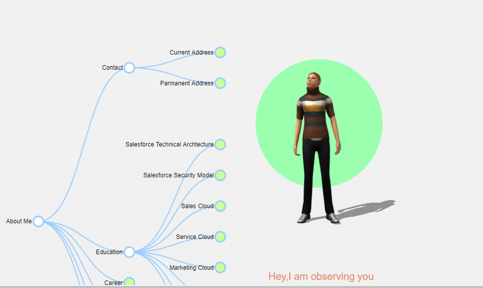

# Interactive 3D Character
This experimental project is to create a online resume in a graphical way by using D3.js and THREE.js. There are very popular library for data driven documnetation and graphics programming. This is create for learnig and fun puppose . Any one can change the JSON(./js/training-data.js) to create own resume. 

Demo : https://erssrm.github.io/about-me/

## How to start the project
1) Clone project: git clone https://github.com/erssrm/about-me.git
2) Install dependency: npm i 
3) Run: npm start

## Feature implimented 

1) Live reload using "live-server" module
2) D3.js implimentation to show the chart
3) Three.js implimentation to load tme model and make it functional

